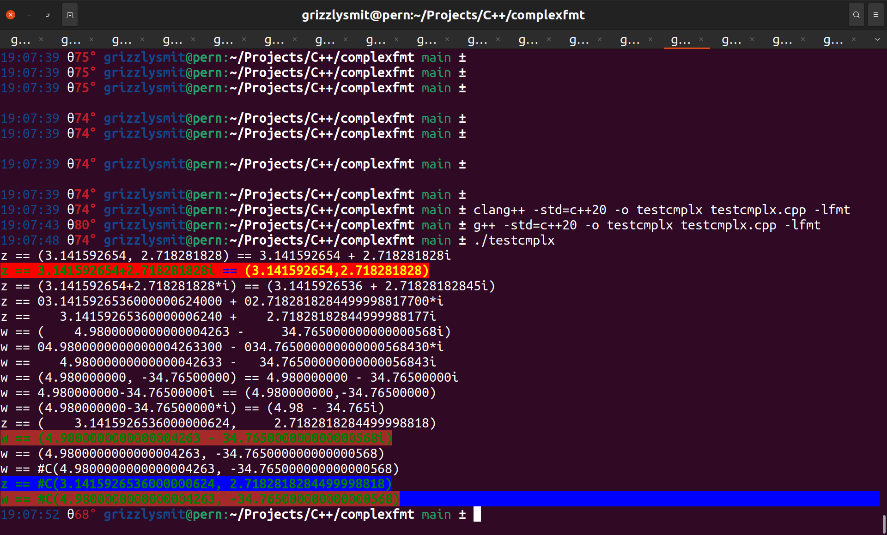

{fmtextras}
===========

## These are my formatter classes for the {fmt} library soon to be std::format

- [Table of contents](#readme)
  * [Introduction](#Introduction)
      * [Licence](#licence)
  * [The std::complex formatter](#the-stdcomplex-formatter)
      * [Spec-Usage](#spec-usage)
  * [The colour/style formatters](#the-colour-style-formatters)
  * [Example code](#example-code)
      * [Results of compiling and running](#results-of-compiling-and-running)


## Introduction

There are three formatters so far in this library 

1. for **`std::complex<T>`**.
2. for **`fmt::text_style`** to allow you to introduce a colour/style change anywhere in your `format_string`. 
3. for **`fmtextras::reset_colour`** to put the colours etc back after changing using a **`fmt::text_style`** argument.

### Licence

I'm releasing this under the LGPL version 3 see the [LICENCE.md](LICENCE.md)  file, or [COPYING](COPYING) for plain text

### The std::complex formatter

This is my formatter class for the {fmt} library soon to be std::format

### Spec-Usage 

For std::complex<T> then the format spec is as follows: 
```
replacement_field ::=  "{" [arg_id] [":" cmplx_format_spec] "}"
arg_id            ::=  integer | identifier
integer           ::=  digit+
digit             ::=  "0"..."9"
identifier        ::=  id_start id_continue*
id_start          ::=  "a"..."z" | "A"..."Z" | "_"
id_continue       ::=  id_start | digit
```

all standard except for `cmplx_format_spec` which is as follows

```
cmplx_format_spec     ::= cmplx_form [ format_spec_for_T ]

cmplx_form            ::= [ three_char_cmplx_spec ]

three_char_cmplx_spec ::= [ style_spec ] three_char_cmplx_spec
                          | [ spacing ]  three_char_cmplx_spec
                          | [ bracket ]  three_char_cmplx_spec

style_spec             ::= '$' | ',' | '*' | '|'

spacing                ::= '_' | ';'

bracket                ::= '@' | '~'
```

where 

  - `$` means expresion style (i.e. **num** **plus_or_minus** **num**_i_ ).
  - `,` means pair style      (i.e. (**num**, **num**) ).
      * **NB: this style overrides brackets i.e. `@` as no brackets makes no sense for this style**
  - `*` means star style      (i.e. **num** **plus_or_minus** **num** _*i_ ), some people like this apperently.
  - `|` means lisp style      (i.e. #C(**num**, **num**) ), this syle is used in common lisp.
      * **NB: this style overrides brackets i.e. `@` as no brackets makes no sense for this style**
  - `_` space the `,` or `+` or `-`
  - `;` don't space `,` or `+` or `-`
  - `@` don't surround with brackets. 
  - `~` surround with brackets.

and **`format_spec_for_T`** is the `format_specifier` for the type **T**.

**NB: I only accept 3 chars in the** _**three_char_cmplx_spec**_.

To compile the the test program **testcmplx** just run 

```
$ g++ -std=c++20 -o testcmplx testcmplx.cpp -lfmt
```

or
```
$ clang++ -std=c++20 -o testcmplx testcmplx.cpp -lfmt
```
where `$` is your prompt or use some sort of make/build system like cmake or what ever.

[Top](#readme)

## The colour-style formatters

There are 2 colour/style formatters

1. for **`fmt::text_style`** to allow you to introduce a colour/style change anywhere in your `format_string`. 
2. for **`fmtextras::reset_colour`** to put the colours etc back after changing using a **`fmt::text_style`** argument.
3. for americans there is **`fmtexras::reset_color`** which is an alias to **`fmtextras::reset_colour`**.

**NB:** The colour stuff 1. & 2. can work with the forms of fmt::format and fmt::print and friends but 3. 
(i.e. **`fmtextras::reset_colour`**) is redundant as they do a reset any way at the end of their call, also 
this works with **`operator""_format()`** where as there is no such fuctionality by default.

**Also Note:** each colour/style change requires a format specifier `{}` will do and a coresponding argumet of 
type **`fmt::text_style`**, be aware that the formater will ignore anything after the `:` as I don't need anything.


[Top](#readme)

## Example code

[godbolt](https://godbolt.org/z/4d9oerj46)

```
#include "complexfmt.h"
#include "colourfmt.h"
#include "fmt/color.h"
#include <ios>
#include <vector>
#include <numeric>
#include <string>
#include <iostream>
#include <fstream>
#include <iomanip>
int main(int argc, char *argv[]){
    using std::complex_literals::operator""i;
    using std::complex_literals::operator""if;
    using std::complex_literals::operator""il;
    using std::literals::string_literals::operator""s;
    using namespace fmt::literals;
    std::complex<double> z = 3.1415926536 + 2.71828182845i;
    std::cout << fmt::format("z == {0:,0.10} == {0:@0.10}\n{1}z {5}=={1} {0:$@;0.10} {3}=={4} {0:,;0.10}{2}\nz == {0:*;0.10} == {0}"s, z,
            fg(fmt::color::green) | bg(fmt::color::red) | fmt::emphasis::bold, fmtextras::reset_colour(),
            fg(fmt::color::blue) | bg(fmt::color::red) | fmt::emphasis::bold,
            fg(fmt::color::yellow) | bg(fmt::color::red) | fmt::emphasis::bold,
            fg(fmt::color::blue) | bg(fmt::color::red) | fmt::emphasis::bold) << std::endl;
    std::cout << fmt::format("z == {:@*0^{}.{}f}", z, 25, 20) << std::endl;
    std::cout << fmt::format("z == {:@ >{}.{}f}", z, 25, 20) << std::endl;
    
    std::complex<double> w = 4.98 - 34.765i;
    std::cout << fmt::format("w == {:{}.{}}", w, 25, 20) << std::endl;
    std::cout << fmt::format("w == {:@*0^{}.{}f}", w, 25, 20) << std::endl;
    std::cout << fmt::format("w == {:@ >{}.{}f}", w, 25, 20) << std::endl;
    std::cout << fmt::format("w == {0:,0.10} == {0:@0.10}\nw == {0:$@;0.10} == {0:,;0.10}\nw == {0:*;0.10} == {0}"s, w) << std::endl;
    std::cout << fmt::format("z == {z:,{width}.{precis}}", "z"_a=z, "width"_a=25, "precis"_a=20) << std::endl;
    std::cout << fmt::format(fg(fmt::color::green) | bg(fmt::color::brown) | fmt::emphasis::bold,
            "w == {thecomplex:$_{width}.{precis}}", "thecomplex"_a=w, "width"_a=20, "precis"_a=20) << std::endl;
    std::cout << fmt::format("w == {thecomplex:,_{width}.{precis}}", "thecomplex"_a=w, "width"_a=20, "precis"_a=20) << std::endl;
    std::cout << fmt::format("w == {thecomplex:|_{width}.{precis}}", "thecomplex"_a=w, "width"_a=20, "precis"_a=20) << std::endl;
    fmt::print(fg(fmt::color::green) | bg(fmt::color::blue) | fmt::emphasis::bold,
            "z == {thecomplex:|_{width}.{precis}}\n", "thecomplex"_a=z, "width"_a=20, "precis"_a=20);
    std::cout << "w == {:|_{}.{}}"_format(w, 20, 20) << std::endl;

    return 0;
}
```

[Top](#readme)

### Results of compiling and running



Either of the two compiler calls will work I did both to show, I have no idea about other compilers.

[Top](#readme)
